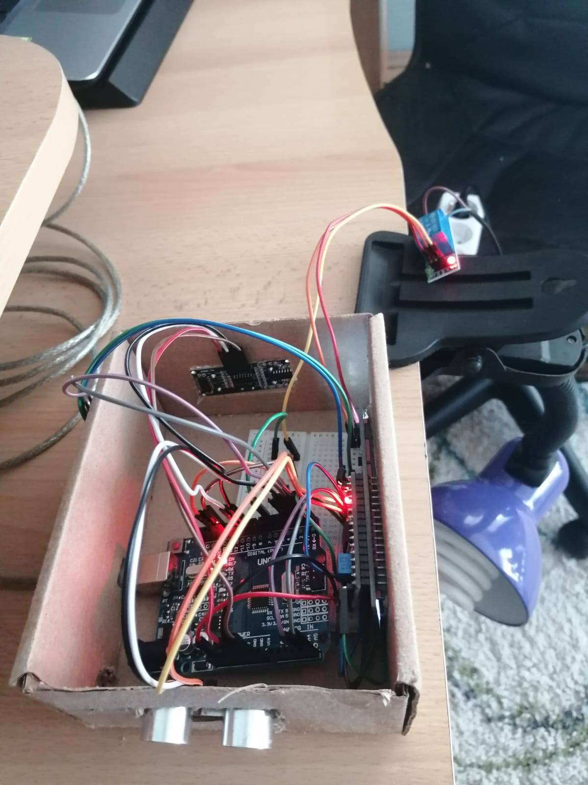
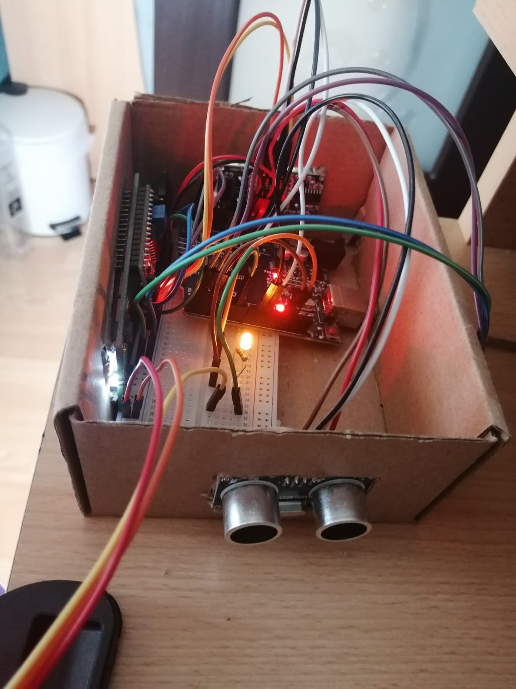
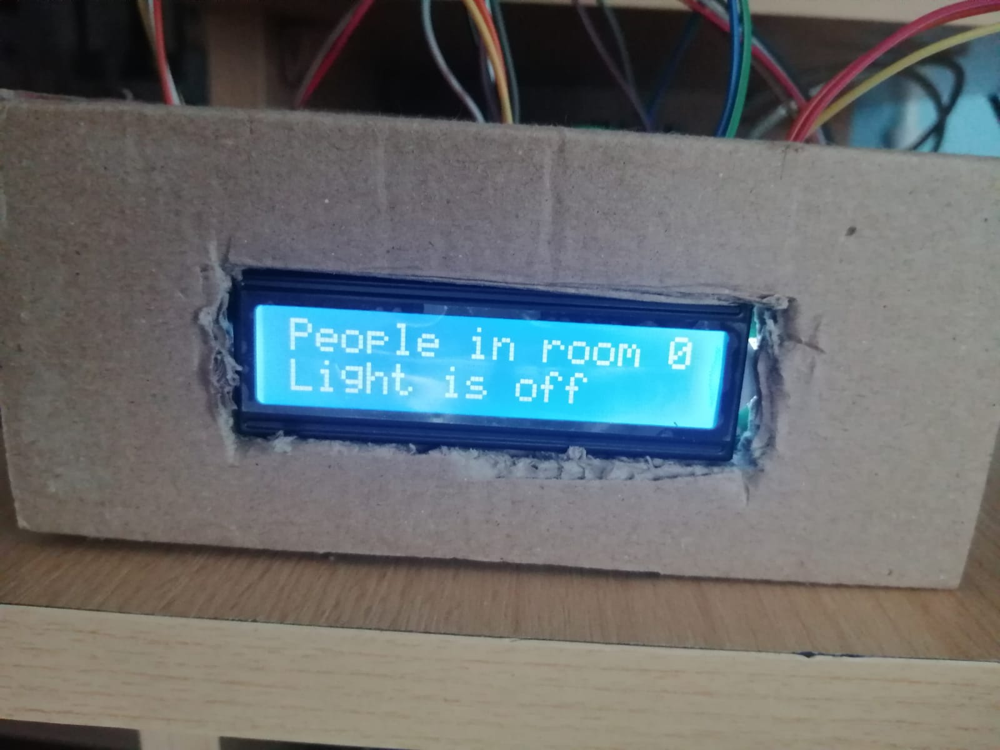

# Lumina automata si alerta detectie persoana cu arduino.

Componentele proiectului sunt:
- Placuta Arduino UNO
- Releu (5v)
- Rezistor
- Senzor proximitate x 2
- 16x2 LCD I2C display
- Bread Board
- Fire
- Led
- Modul bluetooth HC 05/06

Descriere proiect:  
Proiectul se bazeaza pe functionalitatea unor componente precum senzori, releu etc. cu microcontroler arduino. Acest contor poate numara oamenii in ambele directii. Acest tip de circuit poate fi utilizat pentru a numara cate persoane intra si ies dintr-o incapere/hol/casa si de a furniza o sursa de lumina la detectia persoanei.

Acest proiect este un demo si este impartit in mai multe parti: senzori, controler, afisaj. 
Pentru crearea camerei vom folosi o cutie de carton, iar pe laturile sale vom plasa senzorii de proximitate si pe mijloc ecranul LCD pentru a putea vizualiza mesajele.

Unul dintre senzorii de proximitate va fi amplatsat pe latura stanga a cutiei(il vom numi senzor 1), iar al doilea pe latura dreapta a cutiei(il vom numi senzor 2). In momentul in care o persoana/obiect trece la mai putin de 50cm distanta de senzorul din dreapta, incep o secventa in care pun 1 care este semnalul ca senzorul 1 a fost activat. Daca o persoana/obiect trece la mai putin de 50cm de senzorul din stanga, incep secventa cu 2, semnal ca cel de-al doilea senzor a fost activat. 

In continuare verific daca secventa este "12" sau "21". 

Secventa "12" indica faptul ca o persoana a intrat in incapere, se incrementeaza counter-ul pentru numarul de persoane aflate in camera, iar acesta va fi afisat pe ecranul LCD si se va aprinde lumina. Lumina sta aprinsa cat timp in camera exista cel putin o persoana. 

Secventa "21" indica faptul ca o perosna a iesit din incapere, se decrementeaza counter-ul, iar daca acesta atinge valoare 0, lumina se stinge.

Capetele releului inchid circuitul la o lampa aflata in interiorul camerei. In momentul in care senzorul1 se activeaza primul si apoi senzorul2, asta inseamna prezenta unei persoane in camera, data care va fi transmisa catre releu pentru activarea luminii. Daca persoana paraseste camera si senzorul2 se activeaza primul si apoi senzorul1, atunci lumina se va stinge. 

Am implementat 2 moduri de control al luminii. 

Pentru ca utilizatorul sa poata stinge si aprinde lumina oricand doreste cu ajutorul telefonului am adaugat un modul bluetooth conectat la placuta arduino. Am un flag care daca primeste valoare "a", aprinde lumina si daca primeste valoarea "b" stinge lumina fara a tine cont de numarul de persoane din incapere. Pentru a trece la modul de functionare standard, flagul trebuie sa primeasca valoarea "c". 

HC 05/06 functioneaza la comunicarea in serie.

# Conectare elemente la placuta arduino

| Senzor1 | Arduino UNO |
| ------ | ------ |
| GND | GND |
| VCC | 5V |
| Echo | 2 |
| Trig | 3 |

| Senzor2 | Arduino UNO |
| ------ | ------ |
| GND | GND |
| VCC | 5V |
| Echo | 9 |
| Trig | 10 |

| LCD | Arduino UNO |
| ------ | ------ |
| GND | GND |
| VCC | 5V |
| SDA | A4 |
| SCL | A5 |

| Modul bluetooth | Arduino UNO |
| ------ | ------ |
| GND | GND |
| VCC | 5V |
| RXD | TX |
| TXD | RX |

| Releu | Arduino UNO |
| ------ | ------ |
| GND | GND |
| VCC | 5V |
| IN | 6 |

# Link catre prezentarea proiectului
https://youtu.be/XrgPjYZ8zfc - video-ul prezentarii functionalitatii proiectului

# Proiecte similare:
1. Automatic Room Lights using Arduino and PIR Sensor:

https://www.electronicshub.org/automatic-room-lights-using-arduino-pir-sensor/

Sistemul automat de iluminare a camerei care utilizează Arduino este un proiect foarte util, deoarece nu trebuie să vă faceți griji cu privire la pornirea și oprirea comutatoarelor de fiecare dată când doriți să aprindeți luminile. Principalele componente ale proiectului Automatic Room Lights sunt Arduino, senzorul PIR și modulul de releu.

Dintre cele trei componente, senzorul PIR este cel care se concentrează, deoarece este dispozitivul principal care ajută la detectarea omului și a mișcării umane.

De fapt, proiectul Automatic Room Lights poate fi considerat ca o aplicație majoră a senzorului PIR. Un concept similar este deja implementat în robinetele automate de spălare a toaletei, uscătoarele de mână etc.

2. Automatic Room Lights With Visitor Counter!

https://maker.pro/arduino/tutorial/bluetooth-basics-how-to-control-led-using-smartphone-arduino

Acest proiect isi propune a realiza stingerea si aprinderea automata a luminilor in functie de numarul de persoane dintr-o camera. Luminile camerei ar trebui să se aprindă atunci când cineva intră și să se stingă când iese. Daca, in schimb, in camera intra persoana 1 si apoi intra o alta persoana 2, iar persoana 1 paraseste camera luminile nu ar trebui să se stingă la ieșirea uneia dintre ele. Trebuie să se oprească numai când ambii părăsesc camera. Deci, dispozitivul ar trebui să poată număra numărul de persoane care intră în cameră și numărul de persoane care ies.

3. Room Occupancy Counter

https://create.arduino.cc/projecthub/ryanchan/room-occupancy-counter-3b3ffa?ref=part&ref_id=10308&offset=2

Cum pandemia de coronavirus este încă o problemă, este deosebit de important să practici distanțarea socială și să stai departe de ceilalți. Cu toate acestea, acest lucru este dificil de realizat în zonele închise și aglomerate.

Aici poate ajuta Contorul de ocupare a încăperilor. Acesta ține evidența numărului de persoane dintr-o cameră sau clădire prin creșterea unui contor atunci când oamenii intră și scăderea contorului atunci când oamenii pleacă. Odată ce numărul de persoane dintr-o zonă depășește numărul maxim de persoane permise (care poate fi setat de utilizator), o alarmă se va declanșa până când numărul de persoane este din nou în limitele limită.

Acest lucru poate împiedica supraaglomerarea clădirilor și a camerelor, ceea ce poate ajuta la limitarea răspândirii virusului prin simplificarea practicării distanțelor sociale.
